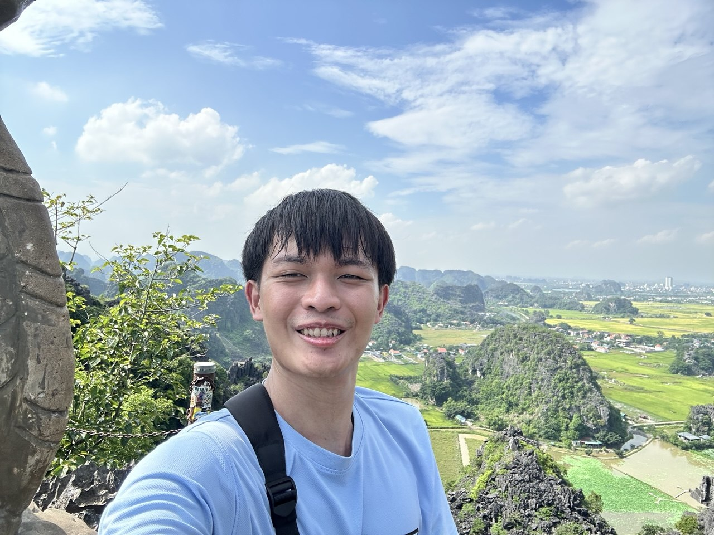
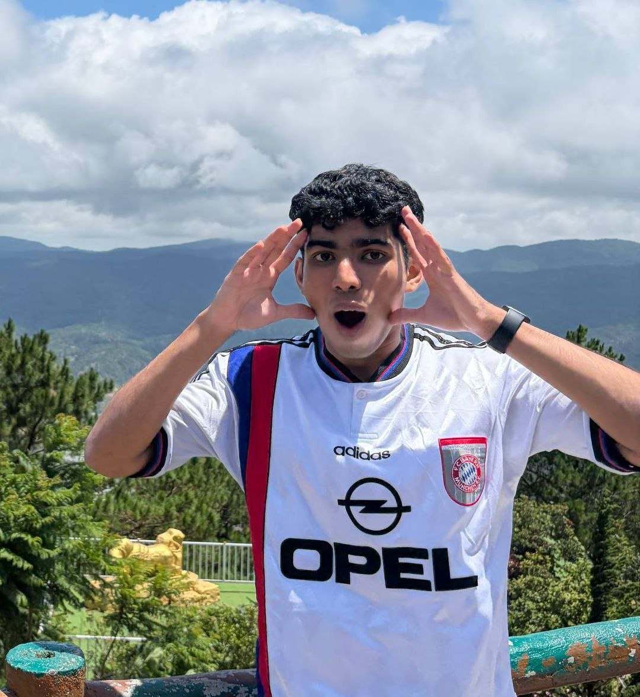
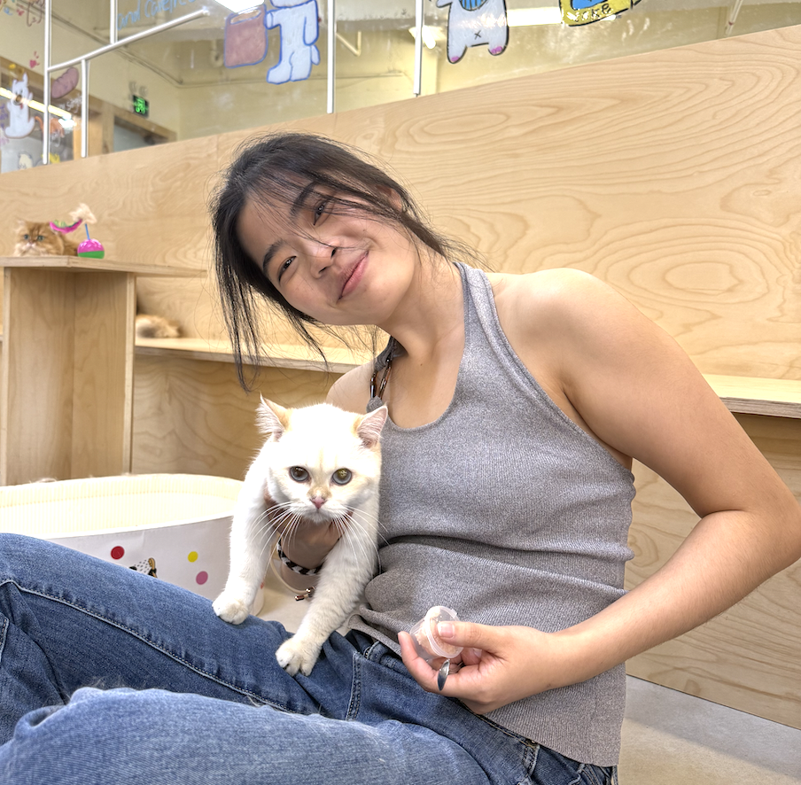
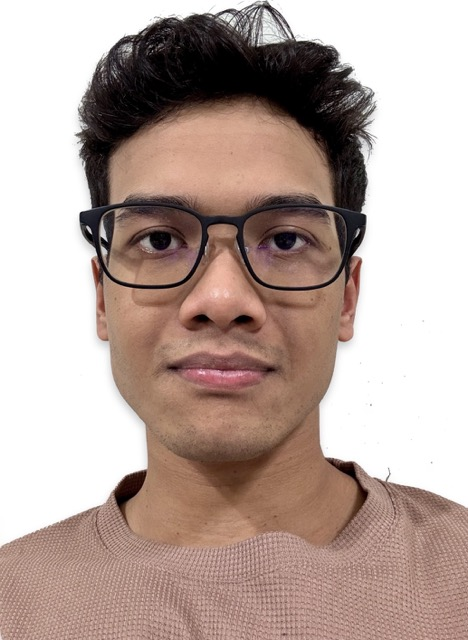

We are a team based in the [School of Computing, National University of Singapore](https://www.comp.nus.edu.sg).

You can reach us at the email `seer[at]comp.nus.edu.sg`

## Project team

### Josthan Wong

[[github](https://github.com/josthan12)]

* Role: Democratic Member
* Responsibilities: TBC

### Ayush Jain

[[github](https://github.com/Ayushjain8541)]

* Role: TBC
* Responsibilities: TBC

### Gwen Lim

[[github](https://github.com/gwenlim89)]

* Role: Developer and Tester
* Responsibilities: Implement features and bug fixes; write and maintain tests; report bugs and verify fixes.

These roles and responsibilities are provisional and will be confirmed after team discussion.

### Jean Doe

[[github](http://github.com/johndoe)]
[[portfolio](team/johndoe.md)]

* Role: Developer
* Responsibilities: Dev Ops + Threading

### Somaaditya Samal

[[github](https://github.com/SomaadityaSamal)]

* Role: Developer and Tester
* Responsibilities: Implement features and bug fixes; write and maintain tests; report bugs and verify fixes.
