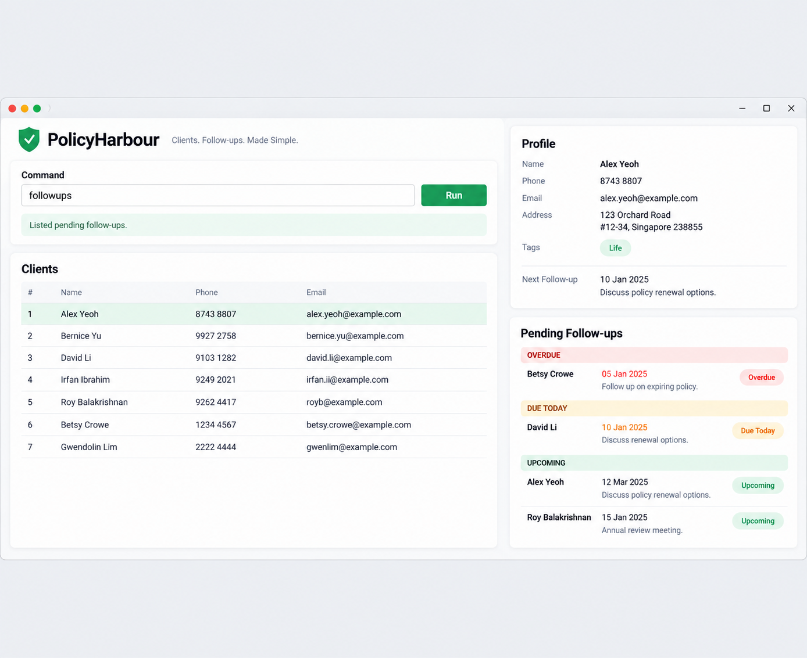

AddressBook Level 3 (AB3) is a **desktop application for managing contacts, optimized for use through a Command Line Interface (CLI)** while retaining the benefits of a Graphical User Interface (GUI). If you type quickly, AB3 can help you manage contacts faster than traditional GUI applications.

* Table of Contents
{:toc}

--------------------------------------------------------------------------------------------------------------------

## Quick start

1. Ensure that Java `25` or later is installed on your computer.<br>
   **Mac users:** Ensure you have the precise JDK version prescribed [here](https://se-education.org/guides/tutorials/javaInstallationMac.html).

1. Download the latest `.jar` file from [here](https://github.com/se-edu/addressbook-level3/releases).

1. Copy the file to the folder you want to use as the _home folder_ for your AddressBook.

1. Open a terminal, `cd` to the folder containing the JAR file, and run `java -jar addressbook.jar`.<br>
   A GUI similar to the one below should appear in a few seconds. Note how the app contains some sample data.<br>
   

1. Type a command in the command box and press Enter to execute it. For example, type **`help`** and press Enter to open the help window.<br>
   Some example commands you can try:

   * `list` : Lists all contacts.

   * `add n/John Doe p/98765432 e/johnd@example.com a/John street, block 123, #01-01` : Adds a contact named `John Doe` to the Address Book.

   * `delete 3` : Deletes the 3rd contact shown in the current list.

   * `clear` : Deletes all contacts.

   * `exit` : Exits the app.

1. Refer to the [Features](#features) section below for details of each command.

--------------------------------------------------------------------------------------------------------------------

## Features

<div markdown="block" class="alert alert-info">

**:information_source: Notes about the command format:**<br>

* Words in `UPPER_CASE` are the parameters to be supplied by the user.<br>
  For example, in `add n/NAME`, replace `NAME` with a value such as `John Doe`.

* Items in square brackets are optional.<br>
  For example, `n/NAME [t/TAG]` can be used as `n/John Doe t/friend` or as `n/John Doe`.

* Items followed by `…`​ can appear zero or more times.<br>
  For example, `[t/TAG]…​` may be omitted, or written as `t/friend` or `t/friend t/family`.

* Parameters can be in any order.<br>
  For example, if the command specifies `n/NAME p/PHONE_NUMBER`, `p/PHONE_NUMBER n/NAME` is also acceptable.

* Extraneous parameters for commands that take no parameters, such as `help`, `list`, `exit`, and `clear`, are ignored.<br>
  For example, `help 123` is interpreted as `help`.

* If you are using a PDF version of this document, be careful when copying and pasting commands that span multiple lines as space characters surrounding line-breaks may be omitted when copied over to the application.
</div>

### Viewing help: `help`

Shows a message explaining how to access the help page.


Format: `help`


### Adding a client: `add`

Adds a client with their contact details and optional tags. A successful add returns to the full client list in insertion order; the new client has no follow-up yet.

Format: `add n/NAME p/PHONE_NUMBER e/EMAIL a/ADDRESS [t/TAG]...`

Supply each required prefix exactly once. The prefixes may appear in any order and must be preceded by an ordinary space. Tags may appear repeatedly and have no count limit. Outer ordinary spaces are removed from field values.

| Field | Accepted values |
| --- | --- |
| Name | Non-blank English letters, digits and ordinary spaces. Case and internal spaces are preserved. |
| Phone | At least three digits `0`–`9`. Leading zeroes are retained. |
| Email | Alphanumeric groups separated by single `+`, `_`, `.` or `-` before one `@`; domain labels contain alphanumeric groups separated by single hyphens and labels separated by dots. The final label must contain two adjacent letters or digits. Stored case is preserved. |
| Address | Non-empty single-line text, including punctuation, non-English text and emoji. |
| Tag | One or more English letters or digits. Tags are stored in lowercase; repeated case variants become one tag. |

Use one command line and ordinary spaces. Tabs, control characters and line separators are rejected. There are no additional contact-length limits.

A client is a duplicate when **their name matches and either their phone or email matches** an existing client. Names are compared ignoring English case and repeated ordinary spaces; phones match exactly, and emails ignore case. Address, tags and follow-up do not affect this check. Two clients may share a name if both their phone and email differ. Different names may share contact details. Duplicate checks include clients hidden by the current filter.

Examples, entered into a list without these clients:

* `add n/Rachel Lim p/001 e/Rachel@example.com a/Blk 123 t/HEALTH t/active t/health` adds Rachel and displays `Tags: [active] [health]`.
* `add n/Rachel Lim p/002 e/other@example.com a/新加坡 🏠` adds a second Rachel because both contact details differ.
* `add n/RACHEL  LIM p/001 e/new@example.com a/Another address` fails with `This client already exists in Policy Harbour.` because the first Rachel has the same normalized name and phone.

Success text includes the name, phone, email, address and sorted lowercase bracketed tags separated by spaces. Without tags, it ends in `Tags: None`. For example:

```text
New client added: Rachel Lim; Phone: 001; Email: Rachel@example.com; Address: Blk 123; Tags: [active] [health]
```

A missing required prefix or extra text before the first prefix produces:

```text
Invalid command format!
Usage: add n/NAME p/PHONE_NUMBER e/EMAIL a/ADDRESS [t/TAG]...
```

These shape errors take priority over repeated required prefixes. After shape and repeated-prefix checks, values are checked in this order: name, phone, email, address, then tags. Duplicate checking comes after validation. An unrecognized prefix inside a field remains literal text: for example, `z/unit` inside an address is allowed, while the same text inside a phone makes the phone invalid.

Changes are saved before they appear in the list. If saving fails, the previous data and list remain and the result says `Changes could not be saved. No changes were kept. Try the command again.` If saved data could not be loaded at startup, adding clients is blocked to protect that file.

### Listing all persons: `list`

Shows a list of all persons in the address book.

Format: `list`

### Editing a person: `edit`

Edits an existing person in the address book.

Format: `edit INDEX [n/NAME] [p/PHONE] [e/EMAIL] [a/ADDRESS] [t/TAG]…​`

* Edits the person at the specified `INDEX`. The index refers to the index number shown in the displayed person list. The index **must be a positive integer** 1, 2, 3, …​
* At least one of the optional fields must be provided.
* Existing values will be updated to the input values.
* When editing tags, all of the person's existing tags are removed; adding tags is not cumulative.
* To remove all of a person's tags, enter `t/` without a tag after it.

Examples:
*  `edit 1 p/91234567 e/johndoe@example.com` Edits the phone number and email address of the 1st person to be `91234567` and `johndoe@example.com` respectively.
*  `edit 2 n/Betsy Crower t/` Edits the name of the 2nd person to be `Betsy Crower` and clears all existing tags.

### Locating persons by name: `find`

Finds persons whose names contain any of the given keywords.

Format: `find KEYWORD [MORE_KEYWORDS]`

* The search is case-insensitive; for example, `hans` matches `Hans`.
* Keyword order does not matter; for example, `Hans Bo` matches `Bo Hans`.
* The search considers only names.
* Only full words match; for example, `Han` does not match `Hans`.
* Persons matching at least one keyword are returned (an `OR` search); for example, `Hans Bo` returns `Hans Gruber` and `Bo Yang`.

Examples:
* `find John` returns `john` and `John Doe`
* `find alex david` returns `Alex Yeoh`, `David Li`<br>
  

### Deleting a client: `delete`

Deletes the client at an index in the **currently displayed list**. After `find`, use the search-result indices; after `followups`, use the pending list's due-date order. Deleting a client also removes their follow-up. The active list mode remains unchanged and its rows are renumbered.

Format: `delete INDEX`

Supply exactly one index, using digits `0`–`9`, from `1` to `2147483647`. Leading zeroes are allowed: `delete 02` means `delete 2`. The index must also refer to an existing displayed row.

Examples:

* `list` followed by `delete 2` deletes the second client in the full list.
* `find Rachel` followed by `delete 1` deletes the first Rachel shown, preserving any other same-name client.
* `followups` followed by `delete 01` deletes the first pending client shown, even if that client occupies another position in the full list.

Success text uses the deleted client's contact details and sorted tags, without their follow-up. For example:

```text
Deleted client: Rachel Lim; Phone: 001; Email: Rachel@example.com; Address: Blk 123; Tags: [active] [health]
```

| Input problem | Result |
| --- | --- |
| Missing index or extra tokens, such as `delete 0 extra` | `Invalid command format!` followed by a newline and `Usage: delete INDEX` |
| One invalid index token, such as `0`, `-1`, `abc`, `1.5` or `2147483648` | `Index must be a positive integer from 1 to 2147483647.` |
| Valid index beyond the displayed list | `The client index provided is invalid.` |

Shape errors take priority over index syntax. A rejected delete leaves data, the current list and date unchanged. A save failure also keeps the previous state and reports `Changes could not be saved. No changes were kept. Try the command again.` Deletion is blocked if saved data could not be loaded at startup.

### Clearing all entries: `clear`

Clears all entries from the address book.

Format: `clear`

### Exiting the program: `exit`

Exits the program.

Format: `exit`

### Saving the data

AddressBook automatically saves data after every command. You do not need to save manually.

### Editing the data file

AddressBook data is saved automatically as a JSON file `[JAR file location]/data/addressbook.json`. Advanced users are welcome to update data directly by editing that data file.

<div markdown="span" class="alert alert-warning">:exclamation: **Caution:**
If your changes make the data file invalid, AddressBook starts with an empty address book at the next run. The invalid file remains on disk until you run a command (AddressBook saves after every command). Still, we recommend backing up the file before editing it.<br>
Furthermore, certain edits can cause the AddressBook to behave in unexpected ways (e.g., if a value entered is outside of the acceptable range). Therefore, edit the data file only if you are confident that you can update it correctly.
</div>

### Archiving data files `[coming in v2.0]`

_Details coming soon ..._

--------------------------------------------------------------------------------------------------------------------

## FAQ

**Q**: How do I transfer my data to another computer?<br>
**A**: Install the app on the other computer and overwrite the data file it creates with the data file from your previous AddressBook home folder.

--------------------------------------------------------------------------------------------------------------------

## Known issues

1. **When using multiple screens**, if you move the application to a secondary screen, and later switch to using only the primary screen, the GUI will open off-screen. The remedy is to delete the `preferences.json` file created by the application before running the application again.
2. **If you minimize the Help Window** and then run the `help` command (or use the `Help` menu, or the keyboard shortcut `F1`) again, the original Help Window will remain minimized, and no new Help Window will appear. The remedy is to manually restore the minimized Help Window.

--------------------------------------------------------------------------------------------------------------------

## Command summary

Action | Format, Examples
--------|------------------
**Add** | `add n/NAME p/PHONE_NUMBER e/EMAIL a/ADDRESS [t/TAG]...` <br> e.g., `add n/James Ho p/22224444 e/jamesho@example.com a/123, Clementi Rd, 1234665 t/friend t/colleague`
**Clear** | `clear`
**Delete** | `delete INDEX`<br> e.g., `delete 3`
**Edit** | `edit INDEX [n/NAME] [p/PHONE_NUMBER] [e/EMAIL] [a/ADDRESS] [t/TAG]…​`<br> e.g., `edit 2 n/James Lee e/jameslee@example.com`
**Find** | `find KEYWORD [MORE_KEYWORDS]`<br> e.g., `find James Jake`
**List** | `list`
**Help** | `help`
